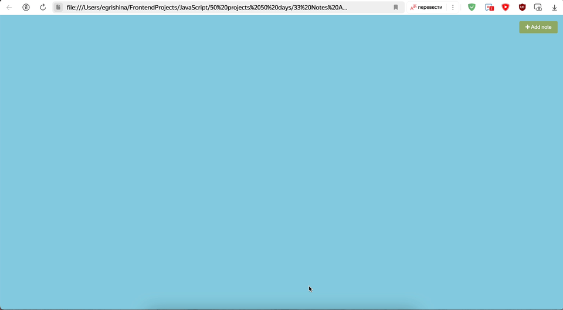
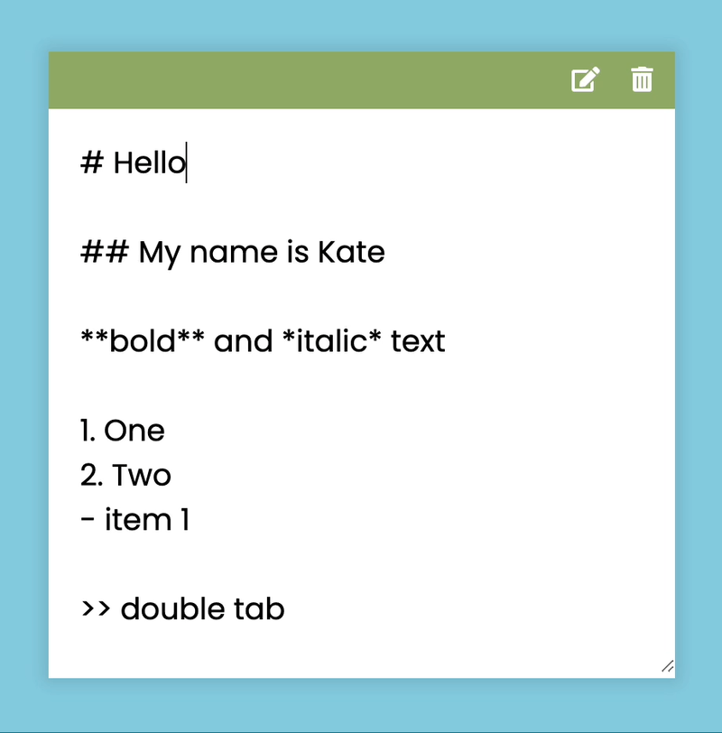

# Заметки

### [Демо приложения](https://kaktusgr.github.io/notes-app/)

## Описание

Учебный мини-проект приложения заметок, созданный на основе HTML, CSS и JavaScript.

Приложение позволяет создавать и редактировать заметки, а также сохраняет их в local storage.\
Поддерживает известные способы оформления заголовков, списков и стилизации текста.

> Данный проект является одним из 50 учебных проектов, выполненных по урокам на платформе [Udemy](https://www.udemy.com/course/50-projects-50-days/?referralCode=684EE5F9DE1745B6428B&couponCode=ST7MT41824).